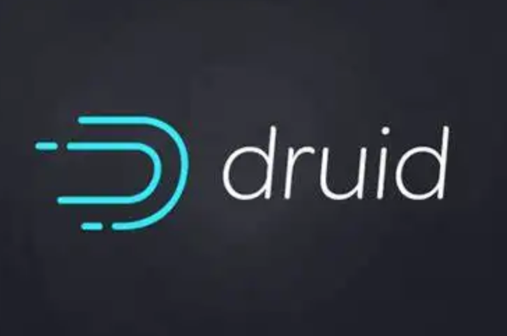
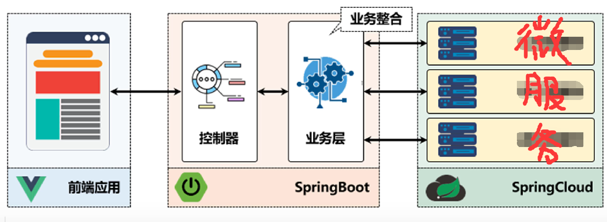
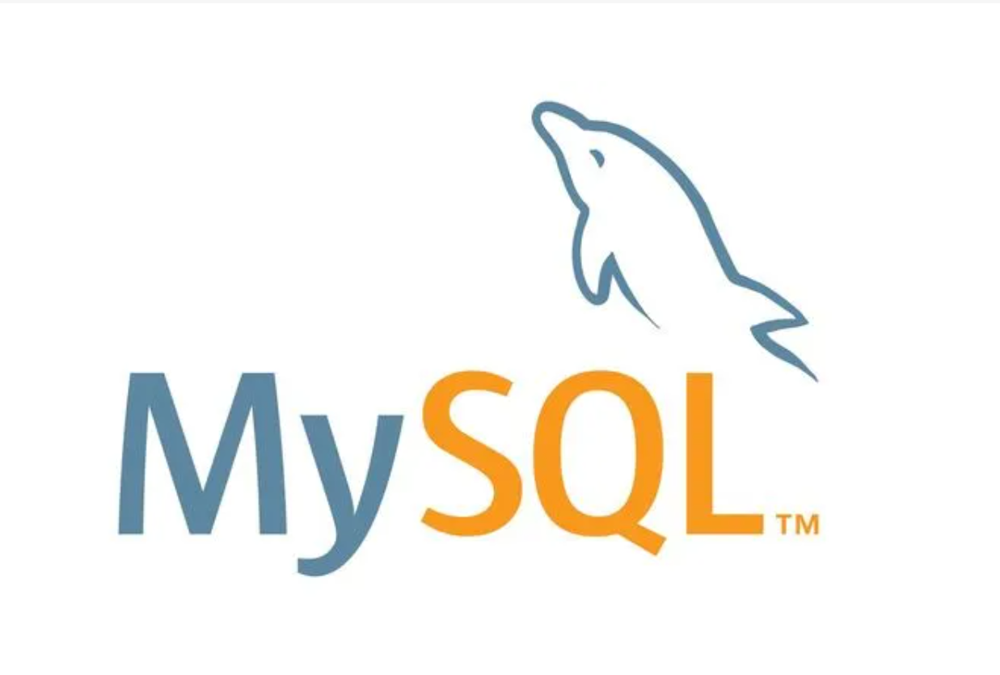

# 智能信号灯
## --叶镓瑜&杨曦
---

# 项目背景
### 为了解决城市交通基础设施建设速度跟不上迅速增长的交通需求，常规公共交通萎缩、出租车和私家车迅速增加、轨道交通开始起步、交通管理技术水平低等问题。
---

# 主要功能
​**本系统致力于打造一套基于物联网的交通疏通系统，该系统通过传感器实时上传道路车流量信息，通过后台自动计算分析来控制信号灯时长变换并对接下来道路情况进行预测，有效地调节路口车辆的通行情况，减少人力消耗的同时提高交通通行效率。传感器所收集到的信息可以传送到管理端，可以显示城市各处交通路口信号灯的情况和车流量，以不同颜色热力图显示道路拥堵情况，在发生道路拥堵严重或者交通事故发生后系统会发出警报，提示工作人员查看道路交通信息。同时本系统还接受人工干预，以便在发生紧急情况时，快速调整道路信号灯情况，为紧急车辆打造专属通道。**

---

# 功能列表
### 交通数据监测模块
### 信号灯管理模块
### 数据统计模块
### 视频监控模块

---

交通数据监测模块
---
- 实时显示某区域基于点位交通拥堵程度的**热力图**。
- 显示较拥堵的**点位列表**，按拥堵程度从大到小排列，并实时更新。
- 通过点击热力图中某点位或者搜索点位名称获取并展示该点位实时交通情况（监控画面、车流量、人流量、车辆平均时速拥堵状态），以及通过折线图的形式展示该点位历史5小时车流量变化和未来5小时**车流量变化趋势**。
- 显示**违法和违法车辆列表**，实时更新。
- 当某点位出现**特殊车辆**（救护车、警车、消防车）鸣笛、非法车辆、违法车辆时，系统给出画面和声音**提示**。
- **查看违法和非法车辆信息**，包括时间、地点、车牌号、违法类型等。
- 通过条件**搜索获取车辆信息**。

---

信号灯管理模块
---
- 实时显示某区域基于点位**红绿灯状态**（是否故障）图。
- 通过点击图中某点位或搜索点位名称获取查看以及修改该点位**红绿灯配时方案**，并展示出该点位路况均衡指数24小时变化趋势和各个方向的车流量、人流量。
- 查看和修改点位常规配时方案；**人工设置点位临时配时方案**和应用时长；点位配时方案交由系统管理（实时智能管理，既后端根据实时交通情况提供实时的配时方案）；系统管理结束后可选择是否使用常规配时方案，如果不使用可人工设置配时方案。
- 选择起点和终点或者选择多个点位**设置绿波带和绿波带使用时长**，使用时间结束后，系统提示是否继续使用绿波带，如果继续使用可设置使用时间，如果不继续使用，各点位恢复原来信号灯配时。

---

数据统计模块
---
- 展示一个月之内，点位在特定时间点的**车流量、人流量**变化情况。
- 展示一个月内，某区域在特定时间点的**交通流量热力图**。

---

视频监控模块
---
- 重点点位监控画面轮播。
- 多个监控画面同时播放。
- 通过搜索点位，调出该点位的监控画面。

---

# 原型设计
## 主页->

---

---

# 交通监测
## 点位监测

---

---

# 交通监测
## 违规监测

---

---

# 信号灯管理
## 信号灯列表和信号灯详情

---

---

# 信号灯管理
## 配时管理和绿波带配置

---

---

# 数据统计
## 历史点位流量和热力图

---

---

# 系统构架设计
# 前后端分离的微服务架构
---
# 前端技术方案

---

# 前端核心框架与技术
本项目中前端采用Vue + Vue-router + Vuex + Axios以及构建工具Vue-cil作为系统前端开发的核心框架

---

Vue.js 是一个JavaScript MVVM库，是一套构建用户界面的渐进式框架。它是以数据驱动和组件化的思想构建的，采用自底向上增量开发的设计。相比于Angular.js，Vue.js提供了更加简洁、更易于理解的API，使得我们能够快速地上手并使用Vue.js；同时比起 React + Redux 相对复杂的架构，Vue.js 更加轻量级也更加容易上手，是初创项目的首选前端框架。
Vue 的核心库只关注视图层，它不仅易于上手，还便于与第三方库或既有项目整合。另外，Vue.js的模块化和组件化开发，能大大增加代码的复用性，允许我们使用小型、独立和通常可复用的组件构建大型应用。

---

本项目中使用Vue-router来实现领域实体之间的交互关系。添加Vue-router完成后，将组件映射到路由然后指定渲染路径。通过注入路由器，可以在任何组件内通过this.\$router 访问路由器，也可以通过 this.\$route 访问当前路由。

---

本项目中使用Vuex进行了集中式存储管理应用的所有组件的状态，Vuex 是专门为 Vue.js 设计的状态管理库，以利用 Vue.js 的细粒度数据响应机制来进行高效的状态更新。主要是为了组件之间的交流，同时把组件的耦合性降到最低。对于前后端实时通讯数据保存以及组件交流提供了有效的管理。

---

本项目中使用Axios，它是基于 Promise 的 HTTP 请求客户端，可同时在浏览器和 Node.js 中使用。axois客户端支持保护安全免受 CSRF/XSRF 攻击,这一特点保障了数据高安全性、高保密性。

---

# 服务端、客户端交互
[RESTfulAPI][restful]

---

# 后端技术方案

---
# 后端核心框架与技术
本项目中后端采用SpringBoot + Druid + Mybatis作为系统后端开发的核心框架

---

# 数据库选择

---

# 谢谢观赏

[restful]: http://www.ruanyifeng.com/blog/2011/09/restful.html